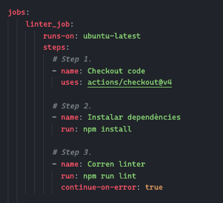

RESULTAT DELS ÚLTIMS TESTS 
 
# GITHUB ACTIONS

### ¿Què son las GitHub Actions?

Les GitHub Actions serveixen per automatizar el fluxe de treball de un projecte
en totes les seues parts, desde les parts inicials com son les idees sobre el 
projecte, fins les parts finals com puga ser el seu desplegament a producció.

Las Github Actions son una plataforma de integración y despliegue continuos 
(CI/CD).

Les GitHub Actions son una plataforma d´integració i desplegament continuo. (CI/CD).

### ¿Per que està composta una GitHub Action?

En una GitHub Action podem encontrar: 

- Workflows.
- Jobs.
- Steps.
- Actions.
- Runners.

- Workflow -> Es el procediment d´automatització què s´agrega a un repositori.
                Pot estar compost d´un o més jobs.
                Els seus llanzadors poden ser "push", "PR", etc.

- Jobs -> Es el conjunt de "steps" què s´executaran, estos por defecte s´executen
            tots en paralel, pero hi ha la possibilitat de què hi haja jobs que esperen
            a altres jobs para poder executar-se.

- Steps -> Es la tasca individual què s´executarà dintre d´un job.

    1. Tipus: 

        + Actions.
        + Scripts (personalitzats).
               
- Actions -> Son las execucions independents que juntes formen un "Step".

- Runners -> Es el servidor que te instal·lada l´aplicació d´execució.

---

## Pràctica GitHub Actions.

### Crear un Workflow amb els següents jobs.

#### Primeres instruccions per al nostre Workflow.

- Push: Estem diguent-li al nostre workflow que s´haura d´executar quan l´usuari faça un push.
- Branches: Este push que llançarà aquest workflow serà a la branca "main".
- Premissions | Contents | write: Estes instruccions li donen permissos d´escritura al nostre 
arxiu .yml. 

#### Linter Job.

##### En la següent imatge podem veure el job Linter_job i per el que està compost:

- Runs-on: Runner on volem que correga, en este cas "ubuntu-latest".
- Name: Nom de l´step.
- Uses: Acció que va a utilitzar el nostre step.
- Continue-on-error: Açò farà que el nostre fluxe de treball no s´ature a pessar de que hi haja algún error.

##### Desglosament del job:

1. Primer correm el runner.
2. El primer step s´encarregara de "checkejar" el còdig.
3. Una vegada "checkejat" el còdig instal·lar-hem les dependències necessaries.
4. Executar-hem el linter per vore que tot el còdig complix amb els requisits.

##### Resultat del linter:

Com podem veure a la foto el nostre linter ha detectat errates que no complixem amb les especificacions generals
del nostre projecte, en concret: 

- Errata de comilles.
- Errata de definició de variables.
- Errata d´ordre a l´estructura d´un switch.

##### Errates: 

##### Solucionant els problemes:

##### Conclusió.

El linter s´encarreguará de comprobar les regles que nosaltres hem configurat en l´arxiu ".eslintrc.json" per vore que
el còdig complix amb tots els requisits especificats, en cas contrari, el job ens ixirà com a fallit.

Els errors que pot troba aquest job poden ser: 

- Problemes d´estils.
- Errors de sintaxis.
- Problemes de qualitat.

#### Cypress Job.

##### En la següent imatge podem veure el job Cypress_job i per el que està compost:

##### El que puguem trobar en aquest job en diferencia al "Linter_job" és: 

- Needs: Esta instrucció farà que el "Cypress_job" s´espere a que el "Linter_job" acabe la seua execució.

##### Step 2:

S´encarregarà de fer correr els tests de Cypress.

- Build: Executa el comando per construir l´aplicació.
- Start: Iniciarà l´aplicació. 
- Wait-on: Esperarà fins que l´aplicació estiga disponible a la direcció que hem ficat al workflow.
- Id: Assignem un identificador a aquest step. 

##### Step 3:

S´encarregarà de guardar el resultat dels tests de Cypress a un arxiu (que si no existeix el crearà) anomenat "result.txt".

- Run: Escriu el resultat del pas identificat anteriorment.

##### Step 4:

S´encarregarà de pujar l´arxiu "result.txt" com artejacte del job.

- Path: L´ubicació on allotjarà l´artefacte pujat.

##### Conclusió.

Cypress és l´encarregat de fer les probes d´integració de la nostra aplicació. És molt útil per fer probes "end-to-end" en 
aplicacions web.

Cypress ens pot proporcionar informació molt valiosa sobre l´estabilitat i funcionalitat de la aplicació, a més a més també 
ens dona un bon feedback al respecte. 

- Estat dels tests --> 'Test passat | Test fallit'
- Informació dels errors --> Informació extra de la proba que ha fallat per trazar l´error.

#### Badged Job.

##### En la següent imatge podem veure el job add_badged_job i per el que està compost:

##### Step 2:

Podem veure que a l´Step 2 recuperem l´artefacte anteriorment creat i guardat en l´arxiu "result.txt".

##### Step 3:

En aquest Step el que fem es llegir el contingut de l´arxiu i l´establim com a ixida.

##### Step 4:

En aquest step el que fem és fer us d´una acció personalitzada.

###### Arxiu action.yml

- Explicació de l´acció: 

    - Name: Nom de l´acció.
    - Description: Una breu descripció del que s´encarrega de fer l´acció.
    - Inputs: Paràmetre d´entrada que rep l´acció.
    - Test_result: Nom del paràmetre d´entrada.
    - Required: Indica que el paràmetre que hem escrit abans s´ha de passar de forma "requerida" quan construim el job al
      workflow.
    - Runs: Conte dos paràmetres:

        - Using: Ens indica que utilitza una versió de "node20" per realitzar la tasca.
        - Main: Ubicació de l´arxiu que conte el còdig que s´executarà.

###### Arxiu index.js (Arxiu que contè el còdig a executar).

##### Explicació de l´arxiu index.js.

- El que farem en aques script es arreplegar el resultat dels tests realitzats previament, 
segons siga el resultat afegirem junt al missatge "RESULTAT DELS ÚLTIMS TESTS" afegirem 
l´insignia de cypress, serà d´un tipus si els tests fallen o d´altre tipus si els tests son 
exitosos.

- També el que farem serà llegir l´arxiu "oldreadme" agafar tot el contingut que tinga dit
arxiu i junt al missatge comentat anteriorment, més l´insignia ho afegirem tot junt en l´arxiu
"readme" principal del repositori.

##### Step 5:

En aquest step el que farem serà utilitzant l´acció "EndBug/add-and-commit@v9" farem un commit
i push dels canvits realitzats als nostres arxius.

##### Conclusió.

La tasca d´aquest job és recuperar l´artefacte creat en el job anterior, modificar el arxiu readme principal del repositori i fer un commit i push dels arxius modificats al repositori.

#### Deploy Job.

##### En la següent imatge podem veure el job deploy_job i per el que està compost:

En aquest job s´esperem a que "Cypress_job" acabe les seues tasques. Una vegada finalitzades les tasques de "Cypress_job": 

##### Step 1:

Checkejarem el còdig amb l´acció "actions/checkout@v4".

##### Step 2:

Aquest step s´encarregarà de desplegar el nostre còdig a la plataforma "Vercel". Per a realitzar la tasca
farem executar l´acció "amondnet/vercel-action@v25" la qual necessita que li passem algunes variables per poder realitzar bé la tasca.

- Variables:

    - Token de Vercel.
    - Vercel org id.
    - Vercel project id.

- Argument:

    - vercel-args (--prod).
        
        + Especifiquem que volem que el projecte es desplegue en producció.

##### En cas de no tindre Vercel instal·lat:

##### Pasos que hem executat per instal·lar Vercel i desplegar el projecte a la seua plataforma:

- Pasos a seguir.

    1. npm install -g vercel
    2. vercel login.
        1. Fem el login amb el conter de github.
    3. Executem "vercel". (Seguim els passos de l´instal·lador).

Una vegada executem el comando "vercel", seguimt els passos de l´instal·lador i vorem com l´últim pas és desplega el projecte a la plataforma de vercel de forma exitosa.

Una vegada fet tot este proces, sens crearà l´arxiu ".vercel.json" d´on podrem obtenir les variables d´entorn necessaries anomenades en el punt anterior.

##### Conclusió.

Aquest job va a encarregar-se de desplegar el còdig per a que puga ser accessible desde la següent 
URL: https://kike-valero-practica-github-actions.vercel.app/

#### Notification Job.

##### En la següent imatge podem veure el job deploy_job i per el que està compost:

La primera tasca que realitza aquest job es esperar a que finalitzen la resta dels altres jobs:

- Linter_job.
- Cypress_job.
- Add_badge_job.
- Deploy_job.

En aquest job podem veure en diferencia dels altes jobs que tinguem l´instrucció: 

- if: always()

Aquesta instrucció significa que a pesar del resultat dels altres jobs aquest job s´executarà si o si, no hi ha res que impedixca que aquest job s´execute, també ens va bé perquè rebrem notificació al correu passe el que passe a la nostra github action, tant si va bé com si va mal, i en cas de que qualsevol cosa no haja anat com s´esperava poder adonar-se a temps per executar alguna alternativa.

##### Step 2:

L´Step 2 executarà una action personalitzada, la qual s´encarregarà de enviar un mail al correu que nosaltres indiquem per notificar del resultat de tots els jobs executats anteriorment.

##### Imatge de l´acció.

- Explicació de l´acció:

    - En aquesta acció puguem vore que hi han moltes variables que s´han de passar com a inputs per al correcte funcionament del script que hem definit, el qual serà el encarregat de fer la tasca d´enviar el correu electrònic al usuari que nosaltres decidim.

##### Imatge de l´script.

- Explicació de l´script: 

    - Funció encarregada d´enviar un correu a l´usuari passe el que passe a la nostra github action. Aquest script és el que arreplega les dades dels "secrests" de github i les utilitza per conectar-se al servici "nodemailer",
    encarregat de gestionar eixes dades i enviar el correu amb destinatari, assumpte, cos del missatge que nosaltres definim.

##### Imatge del missatge rebut per el destinatari indicat.

 

---

### Mètriques al Readme del repositori principal.

El que hem fet en aquesta part de la tasca ha sigut modificar l´arxiu de README.md del nostre repositori principal per tal de mostrar les mètriques dels llenguatges que més hem utilitzat al nostre perfil de GitHub.

A continuació mostrem un parell d´imatges: 

1. Imatge del resultat de la action que ens permet mostrar les mètriques al README.md.

2. Imatge del còdig de l´action creada.

